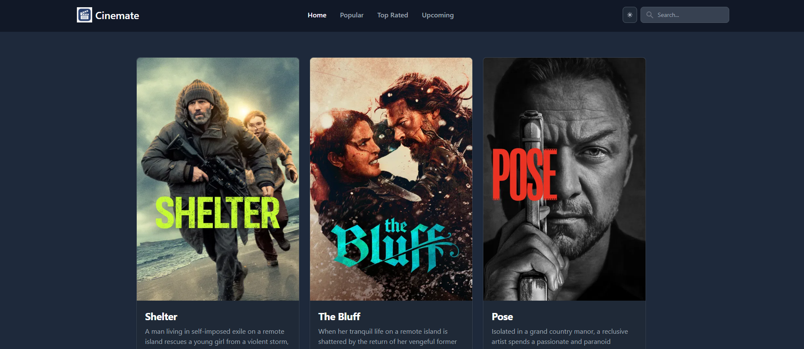
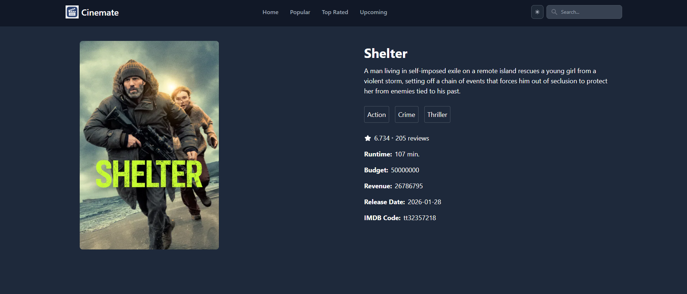
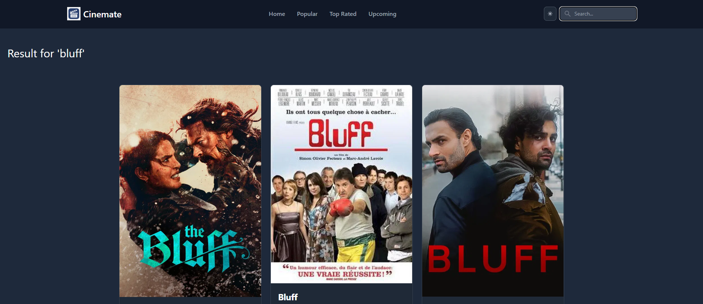

# 🎬 Cinemate

A modern **movie browsing web application** built with **React** and **Tailwind CSS**, inspired by BookMyShow.  
Explore movies, see details, and enjoy a smooth, responsive cinematic UI.

🔗 **Live Demo:** [https://cinemate-bookmyshow.netlify.app/](https://cinemate-bookmyshow.netlify.app/)

---

## 🖼 Screenshots

### Homepage


### Movie Details Page


### Search Functionality



---

## 🚀 Features

#### 🎬 Browse Movies
Explore a collection of movies displayed with posters, titles, and ratings in a clean and visually appealing layout.

#### 📖 Movie Details
Click on any movie to view detailed information including overview, rating, release date, genres, budget, revenue etc.

#### 🔍 Search Functionality
Search for movies by name and get instant results as you type.

#### ⚡ Real-Time Movie Data
Fetches movie data dynamically from the **TMDB API**, ensuring updated movie information.

#### 🧭 Seamless Navigation
Implemented using **React Router** to enable smooth navigation between the homepage and movie details pages.

#### 🎨 Modern UI with Tailwind CSS
Built with **Tailwind CSS** for a modern, responsive, and visually polished user interface.

#### 🧩 Reusable Components
Structured using reusable components like **Header**, **Footer**, and **MovieCard** for better scalability and maintainability.

#### 📱 Responsive Design
Fully responsive layout optimized for **desktop, tablet, and mobile devices**.

---

## 🧰 Tech Stack

- **Frontend:** React  
- **Styling:** Tailwind CSS  
- **Routing:** React Router DOM  
- **API:** TMDB 
- **Deployment:** Netlify  

---

## 🛠 Installation & Setup

1. **Clone the repository**
   ```bash
   git clone https://github.com/shital1223/Front-End-Projects.git

2. **Navigate to the Cinemate project**
   ```bash
   cd Front-End-Projects/React/cinemate
   
3. **Install dependencies**
   ```bash
   npm install

4. **Start the development server**
   ```bash
   npm start

5. Open http://localhost:3000 to view the app.

---

## 📁 Folder Structure
``` cinemate/
├── public/
├── src/
│ ├── components/ # Header, Footer, MovieCard, etc.
│ ├── pages/ #  MovieDetails, MovieList etc.
│ ├── routes/ # AllRoutes.js
│ ├── App.js
│ ├── index.js
│ └── App.css
├── screenshots/ # Screenshots
├── package.json
├── tailwind.config.js
└── README.md
```
---
## 👨‍💻 Author

**Shital Patil**

Software Engineer delivering high-quality applications while staying curious and up-to-date with emerging technologies.

- GitHub: https://github.com/shital1223
- LinkedIn: [https://www.linkedin.com/in/your-linkedin](https://www.linkedin.com/in/shital-patil-498372102/)
